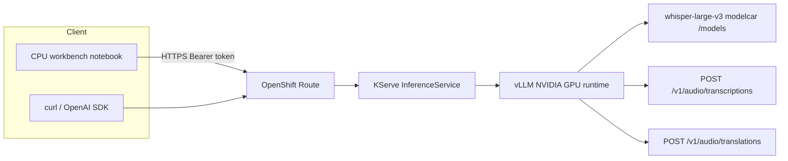

# Architecture

Speech in, text out, on the OpenShift AI 3.4 single-model serving platform (KServe RawDeployment) with vLLM.

## Request path

1. The client sends `multipart/form-data` with an audio file and `model=whisper-large-v3`.
2. The OpenShift Route fronts the KServe predictor (token auth when enabled).
3. The predictor container is vLLM’s OpenAI-compatible server (`python -m vllm.entrypoints.openai.api_server`).
4. Weights load from the OCI modelcar KServe materializes at `/mnt/models`.
5. Transcription returns source-language text. Translation returns **English** text.

Workbench pods **do not** see the presenter’s microphone. Live capture is a future browser app (`getUserMedia` → chunked POSTs). vLLM `stream=true` streams **output tokens for one file**, not an unbounded mic session.

## Kubernetes objects

| Object | Scope | Role in this workshop |
|--------|-------|------------------------|
| Namespace `whisper-workshop` | Project | OpenShift AI Data Science project (`opendatahub.io/dashboard=true`) |
| HardwareProfile | `redhat-ods-applications` | GPU request/limit + scheduling (prefer the cluster’s existing profile) |
| ServingRuntime `whisper-large-v3` | Project | vLLM image + Whisper args |
| InferenceService `whisper-large-v3` | Project | Modelcar `storageUri`, route, auth |
| Secret `whisper-large-v3-sa` | Project | Bearer token for notebooks / curl |
| Workbench | Project | CPU Jupyter client only |

## Audio APIs

| Method | Path | Workshop use |
|--------|------|----------------|
| GET | `/v1/models` | Discover served `id` |
| POST | `/v1/audio/transcriptions` | Speech → text |
| POST | `/v1/audio/translations` | Speech → English (`whisper-large-v3` only, not turbo) |

Upstream: [vLLM speech-to-text](https://docs.vllm.ai/en/latest/serving/online_serving/speech_to_text/). Platform: [Deploying models](https://docs.redhat.com/en/documentation/red_hat_openshift_ai_self-managed/3.4/html-single/deploying_models/index).
