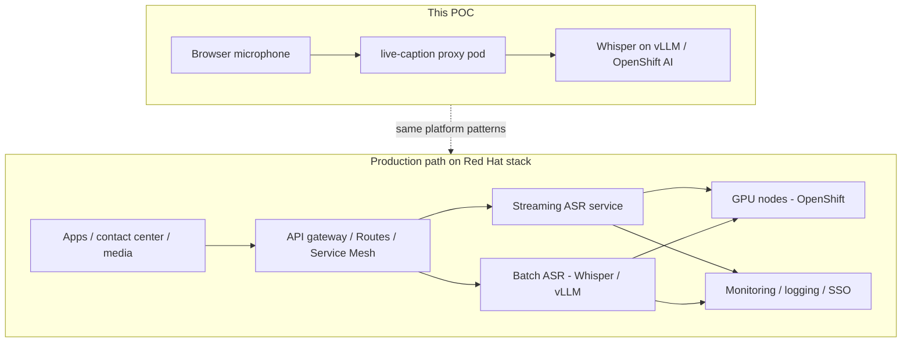

# Whisper live caption (POC)

Optional browser demo for the Whisper workshop. It captures microphone audio, sends speech segments to your deployed Whisper model on OpenShift AI, and displays transcription or translation results.

**This is a proof of concept, not production live captions.** It is useful to show that Whisper on vLLM works end-to-end from a browser, but it does not provide broadcast-grade accuracy or latency.

Use this document when presenting to customers, or share it directly so they understand what the demo proves, what it deliberately does not do, and how a production path fits on the Red Hat stack.

### At a glance (for presentations)

- **What we built:** A thin browser app on top of Whisper-on-vLLM — same APIs as the workshop notebook, with a microphone.
- **What it proves:** Private, GPU-backed speech AI on OpenShift AI, consumable by real applications.
- **What it is not:** Enterprise live captions (no partial streaming, no broadcast SLA).
- **Why that's OK:** The POC de-risks the platform path; production streaming is an additive next step on the same Red Hat stack.

## What this is

```
Browser (mic)  →  live-caption pod  →  Whisper route (/v1/audio/*)
```

- A small FastAPI proxy holds the Whisper bearer token so the browser never sees it.
- The UI records audio and POSTs segments to the proxy, which forwards them to Whisper.
- **Translation** mode is speech → English only (same as the workshop notebook).
- **Transcription** mode keeps the spoken language.

Default capture mode is **send on pause**: audio is only sent when you are speaking, and a segment is submitted after a short pause. This avoids the most common POC failure mode — Whisper hallucinating entire paragraphs on silence.

---

## Why we designed the POC this way

This workshop teaches how to **deploy and consume Whisper on OpenShift AI** — not how to build a captioning product. The live-caption app exists to close one gap in that story: *“Can we use this from a browser, not just a notebook?”*

We intentionally chose the **smallest architecture** that answers that question:

| Design choice | Why |
|---------------|-----|
| Reuse the Whisper route you already deployed | Proves the same inference endpoint works for real-time-ish clients, not just batch notebook calls |
| Chunked HTTP POSTs, not WebSockets | Same API pattern as the workshop notebook; no new protocol or streaming runtime to teach |
| Thin browser proxy pod | Keeps credentials off the client; mirrors how production apps call private model routes |
| “Send on pause” segmentation | Reduces silence hallucinations without adding ML infrastructure |
| No custom model training or fine-tuning | Focus stays on platform deploy, routing, auth, and OpenAI-compatible APIs |

**Batch ASR on a schedule is not a flaw in the demo — it is the point.** Whisper on vLLM is optimized for high-quality transcription of complete audio segments. The POC shows you can wrap that capability in a user-facing experience quickly. Enterprise live captions require a different set of engineering decisions on top.

---

## What this POC demonstrates (the value)

Even without true streaming, this demo shows meaningful platform value:

1. **End-to-end inference** — Microphone → HTTPS route → GPU-backed Whisper → text in the browser.
2. **Private model serving** — The model and token stay on the cluster; the browser only talks to your app.
3. **OpenAI-compatible APIs** — `/v1/audio/transcriptions` and `/v1/audio/translations` work from any client, not just notebooks.
4. **Operational patterns** — Routes, secrets, container builds, and rollout are the same patterns used for other AI workloads on OpenShift.
5. **Translation as a capability** — Speech → English translation is available from the same deployment (workshop scenario: multilingual input, English output).

For many customer conversations, that is enough to answer: *“Can we run speech AI on our own OpenShift AI platform, under our security model, with APIs our apps already understand?”* This POC answers **yes**.

---

## Why we did not build enterprise streaming here

Enterprise-grade live captions (sub-second partial results, stable accuracy under noise, revision of earlier words, SLA-backed latency) are a **product engineering** problem, not a workshop lab.

Building that properly in this workshop would have required:

- A **streaming-native ASR runtime** (or heavy workarounds on batch Whisper)
- A **persistent audio pipeline** (WebSockets or gRPC streaming, backpressure, reconnect)
- **Voice activity detection and segmentation** tuned for your acoustics
- **Hypothesis merging** (partial text that updates and corrects itself)
- **Load, scale, and cost modeling** for continuous GPU use
- **Observability, auth, multi-tenant quotas**, and production SLOs

That is weeks to months of work — and it would distract from the workshop goal of learning **OpenShift AI model deployment**. So we scoped the live-caption app as a **capability preview**, not a production captioning service.

---

## From POC to enterprise streaming: the practical lift tiers

Use this table when customers ask *“What would it take to make this production-ready?”*

### Tier 1 — POC polish (this app)

**What you get:** Safer demos, fewer silence hallucinations, basic presenter workflow.

- Send on pause (browser VAD) instead of timer-only chunks
- Filter known junk patterns (`*stage directions*`, “thank you for watching”, etc.)
- Browser noise suppression; `temperature=0` on requests

**Effort:** hours · **Fit:** workshops, executive briefings, internal pilots

### Tier 2 — Smarter segmentation

**What you get:** More reliable segment boundaries; better behavior in noisy rooms.

- Tuned VAD (e.g. Silero in browser or server-side `vad_config` on supported vLLM builds)
- Push-to-talk / hold-to-speak
- Segment length tuning; optional context carry-over (limited on Whisper)

**Effort:** ~1–3 days · **Fit:** repeated customer demos, controlled environments

### Tier 3 — Pseudo-streaming on Whisper

**What you get:** More “live” feel, still on the same Whisper deployment — but fragile.

- WebSocket audio pipeline
- Overlapping sliding windows and text reconciliation
- Higher GPU utilization; complex tuning

**Effort:** ~1–2 weeks · **Fit:** experiments only — Whisper was not designed for this

### Tier 4 — Enterprise streaming ASR

**What you get:** Production captions — partial results, revision, latency targets, operational maturity.

- Streaming-native model and runtime
- Real-time partial hypotheses and UI revision
- Autoscaling, monitoring, auth, quotas, DR
- Often **complementary** to batch Whisper (not a drop-in replacement)

**Effort:** weeks to months · **Fit:** production products and regulated environments

---

## How the Red Hat stack supports the end state

This POC is a **starting point on the same platform** customers use for production AI — not a dead end.



| Layer | Red Hat / ecosystem role |
|-------|---------------------------|
| **OpenShift AI** | Model serving, projects, workbenches, catalog deploys, GPU scheduling |
| **OpenShift Container Platform** | Routes, secrets, autoscaling, multi-tenancy, compliance-ready ops |
| **vLLM + Whisper (this workshop)** | High-quality **batch** transcription and translation via OpenAI-compatible APIs |
| **KServe / LLMInferenceService** | Standardized model deploy, scale-to-zero, auth in front of inference |
| **OpenShift GitOps / CI** | Promote app + model versions across dev → staging → prod |
| **OpenShift Service Mesh / API management** | Rate limits, mTLS, routing to multiple model backends |
| **Partner / ISV streaming ASR** | NVIDIA Riva, speech ISVs, or custom streaming services **on the same cluster** |

**Typical production architecture:** keep Whisper on OpenShift AI for **file-based and segment-based** workloads (meetings, media archives, call recordings, batch translation). Add a **streaming ASR tier** for live captions and real-time agents — deployed on the same OpenShift footprint, behind the same routes and security controls.

This workshop proves the **batch inference path**. The live-caption POC shows how quickly an application can consume it. Moving to enterprise streaming is an **additive** investment on OpenShift AI, not a rip-and-replace.

---

## Accuracy limits (set expectations)

Whisper is a **batch** model. Each request is an independent decode with no memory of prior segments.

Common issues:

1. **Silence and room noise** — Whisper invents text (`Thank you for watching`, `*Crickets Chirping*`, random sentences). Fixed-interval chunking makes this worse because silence is sent repeatedly.
2. **Chunk boundaries** — Words can be wrong at segment edges; names and jargon may be misheard.
3. **Translation layer** — Translate → English adds another transformation vs transcribe-only.
4. **No confidence scores in UI** — Everything returned is shown unless filtered.

### Presenter tips

- Use a **headset mic**.
- Use **send on pause** (default), not fixed intervals.
- **Stop the microphone** when finished speaking.
- Speak in **full phrases** with brief pauses between thoughts.
- For English-only content, prefer **Transcribe** over **Translate**.

---

## MLflow tracing (optional)

Each speech segment sent to Whisper can be logged as an **MLflow GenAI trace** from the live-caption proxy. This is useful for a closing “observability” demo: show latency, mode, model, and transcript per segment, grouped by mic session.

### What gets traced

| Field | Example |
|-------|---------|
| `mode` | `translations` or `transcriptions` |
| `model` | `whisper-large` |
| `session_id` | UUID per “Start microphone” session |
| `audio_size_bytes` | Size of the WebM segment |
| `speech_duration_ms` | How long the user spoke (from browser VAD) |
| `whisper_latency_ms` | Time waiting on Whisper/vLLM |
| `total_latency_ms` | End-to-end proxy time |
| `text` | Transcript returned by Whisper |

Audio bytes are **not** stored in traces (metadata only).

### Enable on deploy

Set your cluster MLflow tracking URI when deploying:

```sh
export MLFLOW_TRACKING_URI="https://rh-ai.apps.<cluster>.example.com/mlflow"
export MLFLOW_TRACKING_AUTH="kubernetes-namespaced"   # default in deploy scripts
export MLFLOW_K8S_INTEGRATION="true"                # default in deploy scripts
export MLFLOW_EXPERIMENT_NAME="whisper-live-caption"   # optional
# Do not set MLFLOW_TRACKING_TOKEN with kubernetes-namespaced unless debugging

bash extras/live-caption/deploy-quay.sh
```

Or patch the secret manually:

```sh
oc patch secret whisper-live-caption -n whisper-demo --type=merge -p '{
  "stringData": {
    "MLFLOW_ENABLED": "true",
    "MLFLOW_TRACKING_URI": "https://your-mlflow-route",
    "MLFLOW_EXPERIMENT_NAME": "whisper-live-caption"
  }
}'
oc rollout restart deployment/whisper-live-caption -n whisper-demo
```

When enabled, the UI status line shows `MLflow: whisper-live-caption`. If it does not, check pod logs for `MLflow setup failed`.

- RHOAI `kubernetes-namespaced` auth needs `mlflow[kubernetes]` in the image.
- The live-caption **service account** must be bound to ClusterRole `mlflow-operator-mlflow-integration` (same as workbenches). The sample `openshift.yaml` includes that RoleBinding.
- In the MLflow UI, switch workspace to the **project namespace** (`whisper-demo`), not Default.

### End-of-workshop demo flow

1. Speak 2–3 phrases in live-caption (pause between each).
2. Open MLflow → experiment `whisper-live-caption`.
3. Open the **Sessions** tab (or filter metadata `mlflow.trace.session`) — one session per Start microphone.
4. Open a trace: check `whisper_latency_ms`, `mode`, and output `text`.

Talking point: *“Same platform that serves the model also traces production inference — deploy on OpenShift AI, consume via app, observe in MLflow.”*

---

## Deploy on OpenShift

From the **repository root**:

```sh
export WHISPER_BASE_URL="https://your-whisper-route"
export WHISPER_BEARER_TOKEN="your-token"
export WHISPER_MODEL="whisper-large"      # match GET /v1/models
export NAMESPACE="whisper-demo"

bash extras/live-caption/deploy.sh
```

### Build timed out on OpenShift?

Use **Quay** (recommended):

```sh
podman login quay.io
export QUAY_IMAGE="quay.io/<org>/whisper-live-caption:6"
export WHISPER_BASE_URL="https://your-whisper-route"
export WHISPER_BEARER_TOKEN="your-token"
export WHISPER_MODEL="whisper-large"
export NAMESPACE="whisper-demo"
# optional for private repos:
# export IMAGE_PULL_SECRET="quay-pull"

bash extras/live-caption/deploy-quay.sh
```

Or push to the **internal OpenShift registry**:

```sh
bash extras/live-caption/deploy-podman.sh
```

Rebuild the image after changing `static/` or `app.py`.

## Run locally

```sh
cd extras/live-caption
pip install -r requirements.txt
export WHISPER_BASE_URL="https://..."
export WHISPER_BEARER_TOKEN="..."
uvicorn app:app --host 0.0.0.0 --port 8080 --reload
```

Open http://localhost:8080

## Environment variables

| Variable | Purpose |
|----------|---------|
| `WHISPER_BASE_URL` | Whisper route base URL (no trailing slash) |
| `WHISPER_BEARER_TOKEN` | Token for the Whisper route |
| `WHISPER_MODEL` | Model id from `GET /v1/models` |
| `WHISPER_VERIFY_SSL` | `false` for default OpenShift routes |
| `MLFLOW_ENABLED` | `true` to emit traces (default `false`) |
| `MLFLOW_TRACKING_URI` | MLflow tracking server URL |
| `MLFLOW_TRACKING_AUTH` | `kubernetes-namespaced` for OpenShift AI (default in deploy scripts) |
| `MLFLOW_K8S_INTEGRATION` | `true` for in-cluster SA token auth (default in deploy scripts) |
| `MLFLOW_EXPERIMENT_NAME` | Experiment name (default `whisper-live-caption`) |
| `MLFLOW_TRACKING_TOKEN` | Usually **omit** when using `kubernetes-namespaced` |

## Files

| File | Purpose |
|------|---------|
| `app.py` | FastAPI proxy to Whisper |
| `static/` | Browser UI |
| `Dockerfile` | Container image |
| `deploy*.sh` | Build and push helpers |
| `configs/samples/live-caption/openshift.yaml` | Deployment manifest |

## Related workshop material

- Notebook: `extras/notebooks/01-transcribe-translate.ipynb`
- Inference walkthrough: `docs/06-workbench-inference.md`
